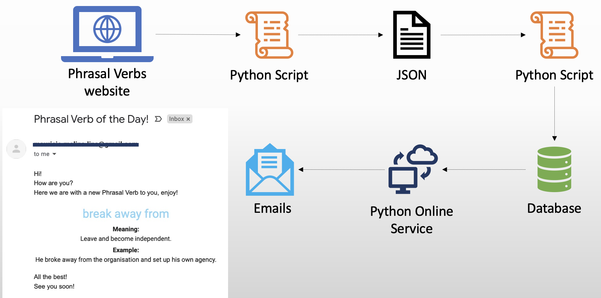

# Phrasal Verbs Service

This is a simple example of data consumption that I have created to support my english learning, I call it as a Phrasal Verb service.

##### What will you find here?

1. A Python web scrapper that to get phrasal verbs from the www.learn-english-today.com website
2. Store the data into a sqlite database
3. Schedule a Python script to send emails containing a phrasal verb every scheduled day, using the Pythonanywhere service

###### To 

